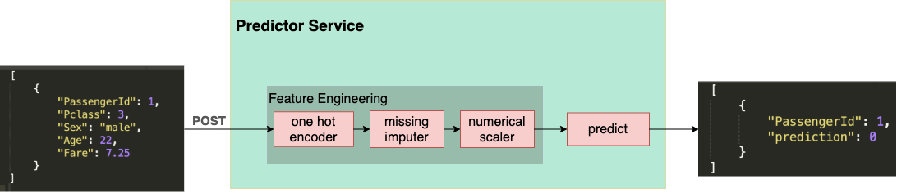

# kaggle_titanic_deploy
Project to deploy a machine learning model based on Titanic dataset from Kaggle

In this project we used the Titanic dataset from [Kaggle](https://www.kaggle.com/c/titanic) to build a simple Machine Learning Model and wrap it into a python application and run a FastAPI service to make real time predictions.

## Prediction Service
The prediction service works as following:


## Run Locally
using docker:
```
docker build -t kaggle_titanic_deploy .
docker run -it -p 8000:8000 kaggle_titanic_deploy 
```

without docker:
```
pipenv install
gunicorn predictor.api.app:app --worker-class uvicorn.workers.UvicornWorker --bind 0.0.0.0:8000
```

## More info
* Link to presentation on Python Brasil 2021: https://www.youtube.com/watch?v=2YAWmpVgn0g
* Link to Medium post: TBD

